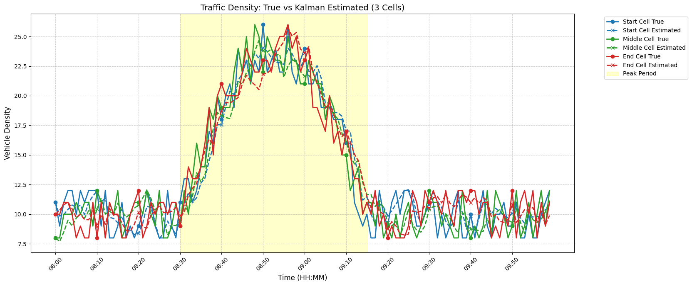

# 🚗 Estimation of Traffic Flow Using Stochastic Models and Kalman Filtering

## 📘 Case Study Overview

This project presents a **case study on traffic flow estimation** for a **5 km single-lane road** segmented into **10 cells of 500 m each**.  
The study employs the **Cell Transmission Model (CTM)** for simulating traffic dynamics and integrates the **Kalman Filter** for real-time traffic density estimation under uncertainty.

A **mid-morning surge between 8:30 AM and 9:15 AM** was modeled to represent realistic congestion patterns.  
The results demonstrate that the Kalman Filter effectively smooths measurement noise and closely follows true traffic trends, providing a reliable approach for traffic state estimation in intelligent transportation systems.

---

## 📊 Result Graph

Below is the visualization comparing **true density** and **Kalman-estimated density** for selected cells during the simulation period:

The plot clearly shows how the **Kalman Filter** tracks the true traffic density, especially during the **congestion surge** period.

---

## 📈 Summary

- Road length: **5 km**, divided into **10 cells (500 m each)**  
- Time range: **8:00 AM – 10:00 AM**  
- Surge period: **8:30 AM – 9:15 AM**  
- Mean Squared Error (**MSE**) ≈ **1.5**, indicating strong estimation accuracy  
- Implemented using **CTM** and **Kalman Filtering**

---

